# 🛡️ TokenSieve — Context-Deduplicating RAG Proxy

[](LICENSE)
[](https://go.dev)
[](https://react.dev)
[](https://docker.com)

**TokenSieve** is an enterprise-grade, stateful caching proxy that sits transparently between developer workflows (Claude Code, Gemini CLI, Cursor, Copilot) and upstream LLM APIs. It applies multi-strategy semantic delta-compression to eliminate the repeated context bloat that drives token costs skyward in continuous agentic loops.

---

## The Problem

As developers loop tools like Claude Code or Gemini Advanced into continuous terminal workflows, the context window fills with:

- Repetitive **system prompts** sent identically on every turn
- Duplicate **file dumps** — the same 500-line module sent 40 times
- Cycling **stack traces** and error logs verbatim across retries
- Redundant **codebase context** re-injected by the IDE on every request

Token bills skyrocket. Context windows saturate prematurely.

## The Solution

An intelligent, stateful caching proxy that **fingerprints, deduplicates, and delta-compresses** all of this before it ever reaches the upstream API.

---

## Architecture

```
┌─────────────────────────────────────────────────────────────────┐
│  Developer Workflow (Claude Code / Cursor / CLI)                │
└──────────────────────────┬──────────────────────────────────────┘
                           │  HTTP (localhost:8080)
                           ▼
┌─────────────────────────────────────────────────────────────────┐
│  TokenSieve Proxy (Go)                                          │
│                                                                 │
│  ① Intercept  → Parse message array + derive session ID         │
│  ② Deduplicate→ SHA-256 fingerprint file blocks / traces / blobs│
│  ③ Compress   → Replace seen blocks with compact TS:REF tokens  │
│  ④ Forward    → Send compressed payload to upstream LLM         │
│  ⑤ Record     → Telemetry: tokens saved, sessions, events       │
└──────────────────────────┬──────────────────────────────────────┘
                           │  HTTPS
                           ▼
             ┌─────────────────────────┐
             │  Upstream LLM API       │
             │  (Anthropic / Gemini /  │
             │   OpenAI-compatible)    │
             └─────────────────────────┘
```

### Project Structure

```
tokensieve/
├── cmd/proxy/main.go              # Reverse proxy engine + request pipeline
├── pkg/
│   ├── cache/sliding_window.go   # LRU sliding-window token cache
│   ├── diff/compression.go       # Multi-pass semantic delta-compression
│   ├── telemetry/recorder.go     # Metrics, session tracking, cost estimation
│   └── auth/middleware.go        # Rate limiting + admin key auth
├── ui/
│   └── src/
│       ├── App.tsx                # Dashboard shell
│       ├── components/            # MetricCard, ActivityFeed, SessionsTable, Chart
│       └── hooks/useMetrics.ts   # Polling hooks + mock data fallback
├── cli/tokensieve                 # Bash wrapper (env injection + health-check)
├── Dockerfile.proxy               # Scratch-based Go image
├── ui/Dockerfile                  # Nginx SPA image
├── docker-compose.yml
└── .env.example
```

---

## Compression Strategies

TokenSieve applies three compression passes in sequence on every request:

| Strategy | Target | Typical Savings |
|----------|--------|-----------------|
| **Whole-message dedup** | Exact duplicate messages in history | 100% of repeated message |
| **File-block dedup** | `--- BEGIN FILE`, `File:`, `<file path=` markers | 80–100% of repeated files |
| **Stack trace dedup** | `Error:`, `panic:`, `Traceback` blocks | 100% of cycling error logs |
| **Large blob dedup** | Paragraphs > 200 chars seen before | 100% of repeated prose |
| **System prompt dedup** | Identical system prompts across turns | 100% on repeated turns |

Compressed segments are replaced with inline reference tokens like:
```
[TS:FILE_CACHE ref=a3f8c21b4d77 path="src/main.go" saved≈1240tok]
```

---

## Quickstart

### Option A: Docker Compose (recommended)

```bash
# 1. Clone and configure
git clone https://github.com/david-spies/tokensieve
cd tokensieve
cp .env.example .env
# Edit .env — set API_KEY and LLM_PROVIDER

# 2. Start all services
docker-compose up --build -d

# 3. Route your CLI through the proxy
export ANTHROPIC_BASE_URL="http://localhost:8080"
claude code --project ./src

# 4. Open the dashboard
open http://localhost:3000
```

### Option B: Run locally

```bash
# Start the Go proxy
go run ./cmd/proxy/

# In a separate terminal, start the dashboard
cd ui && npm install && npm run dev

# Wrap a command
./cli/tokensieve claude code .
```

### Option C: Source the CLI wrapper

```bash
# Sets ANTHROPIC_BASE_URL and other env vars in your current shell
source ./cli/tokensieve
# Now all LLM CLI calls in this shell go through TokenSieve
```

---

## Configuration

| Variable | Default | Description |
|---|---|---|
| `LLM_PROVIDER` | `anthropic` | `anthropic`, `gemini`, or `openai` |
| `API_KEY` / `UPSTREAM_API_KEY` | — | Your LLM provider API key |
| `PORT` | `8080` | Proxy listen port |
| `TOKENSIEVE_ADMIN_KEY` | *(none)* | Optional key for `/api/admin` endpoints |

---

## API Reference

| Endpoint | Method | Description |
|---|---|---|
| `/v1/messages` | POST | Anthropic-compatible messages endpoint (compressed) |
| `/v1/chat/completions` | POST | OpenAI-compatible endpoint (compressed) |
| `/api/metrics` | GET | Full telemetry snapshot (JSON) |
| `/api/cache/stats` | GET | Sliding window cache health |
| `/api/health` | GET | Liveness probe |

All telemetry endpoints include `Access-Control-Allow-Origin: *` for dashboard access.

---

## Dashboard

The React dashboard (`localhost:3000`) provides:

- **Real-time KPI cards** — tokens deduplicated, estimated cost savings, active streams
- **Sliding window cache stats** — entries, hit rate, eviction counts
- **Token flow area chart** — deduplicated vs. passed volume over time
- **Compression event feed** — live stream of dedup events with strategy labels
- **Session table** — per-session savings breakdown with efficiency metrics

The dashboard operates in **demo mode** (animated mock data) when the proxy is offline.

---

## Performance

- **Latency overhead**: < 1ms per request (pure in-memory hashing, no I/O)
- **Memory**: ~50MB baseline; scales with cache size (configurable)
- **Throughput**: > 10k req/s on a single core (Go + sync.RWMutex hot path)
- **Concurrency**: Lock-free read path via `sync/atomic` telemetry counters

---

## Cost Model

TokenSieve uses blended per-provider pricing for savings estimates:

| Provider | Input $/1M | Cached Read $/1M |
|---|---|---|
| Anthropic (Claude) | $3.00 | $0.30 |
| Google (Gemini) | $1.25 | $0.31 |
| OpenAI | $2.50 | $0.50 |

A typical agentic workflow running 4 hours/day with 50% file-context repetition saves **$12–40/month** per developer seat.

---

## Security

- API keys are read from environment variables, never logged or stored
- Session IDs are derived from a SHA-256 hash of auth headers + IP — no PII stored
- Rate limiting: 200 req/min per IP (configurable)
- Admin endpoints optionally protected by `X-Admin-Key` header
- Scratch-based Docker image — zero shell, zero OS attack surface

---

## License

MIT License © 2026 — see [LICENSE](LICENSE)
